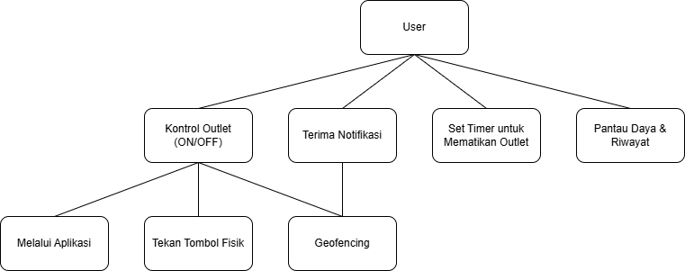
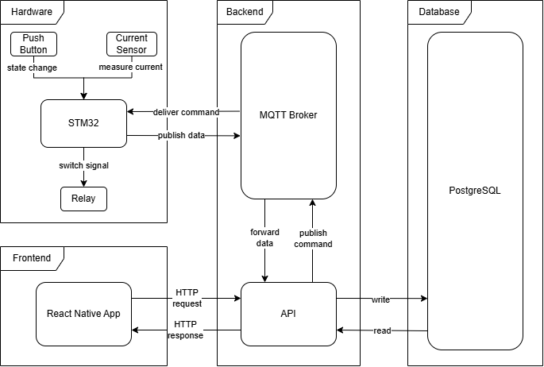
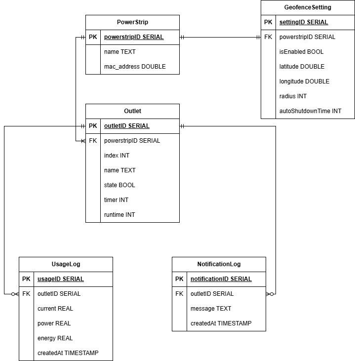
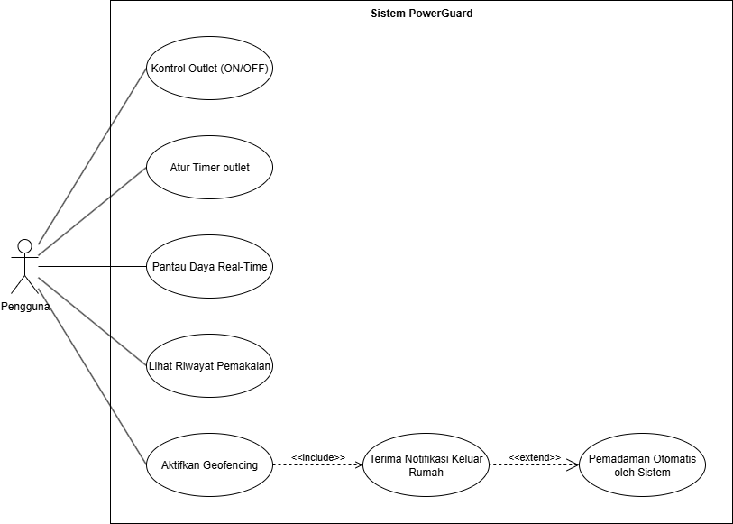

# PowerGuard

A cross-platform mobile application built with Expo and React Native that enables users to monitor real-time power consumption, control smart outlets remotely, and automate energy management through location-based geofencing.

## Features

- **Power Usage Monitoring**: Track and visualize power consumption with interactive charts
- **Smart Settings**: Configure power management preferences and thresholds
- **Reporting**: Generate and view detailed power usage reports
- **Geofencing**: Location-based automation for power management
- **Outlet Control**: Manage individual smart outlets

## Tech Stack

### Frontend
- **Framework**: Expo ~54.0.9
- **Language**: TypeScript
- **UI**: React Native with NativeWind (Tailwind CSS)
- **Navigation**: Expo Router with file-based routing
- **Charts**: Recharts
- **Maps**: React Native Maps & Leaflet
- **Platforms**: iOS, Android, Web

### Backend
- **Framework**: NestJS
- **Language**: TypeScript
- **Database**: PostgreSQL (Azure)
- **ORM**: Prisma
- **MQTT**: Public EMQX
- **Protocol**: MQTT

## Project Structure

This is a monorepo containing both frontend and backend:

```
PowerGuard/
├── app/              # Frontend: Expo Router screens
├── components/       # Frontend: React components
├── services/         # Frontend: API client
├── backend/          # Backend: NestJS API server
│   ├── src/          # Backend source code
│   ├── prisma/       # Database schema
│   └── README.md     # Backend documentation
├── docs/             # Project documentation and diagrams
├── assets/           # Shared assets
└── README.md         # This file
```

## System Architecture

### System Overview


The PowerGuard system consists of three main components:
1. **Mobile Application** (React Native + Expo) - User interface for monitoring and control
2. **Backend API** (NestJS + PostgreSQL) - Manages data and business logic
3. **STM32 Device** - Hardware controller connected via MQTT

### System Layer Architecture


### Database Schema


### Use Cases


### Key Features

#### Geofencing Automation


#### Real-time Monitoring


#### Remote Control


<details>
<summary>View More Activity Diagrams</summary>

#### Timer Activation


#### Manual Control with Push Button


</details>

## Getting Started

### Prerequisites

- Node.js (LTS version recommended)
- npm or yarn
- Expo CLI
- For iOS development: Xcode
- For Android development: Android Studio

### Installation

1. Clone the repository
```bash
git clone <repository-url>
cd PowerGuard
```

2. Install frontend dependencies
```bash
npm install
```

3. Install backend dependencies
```bash
cd backend
npm install
cd ..
```

4. Configure backend environment (see `backend/.env.example`)

5. Start the development servers

**Terminal 1 - Backend:**
```bash
cd backend
npm run start:dev
```

**Terminal 2 - Frontend:**
```bash
npm start
```

### Running the App

In the terminal output, you'll find options to open the app:

- Press `i` for iOS simulator
- Press `a` for Android emulator
- Scan the QR code with Expo Go app on your physical device

Alternatively, run platform-specific commands:

```bash
# Android
npm run android

# iOS
npm run ios

# Web
npm run web
```

## Development

The project uses file-based routing via Expo Router. Main directories:

- `app/`: Application screens and routes
  - `(tabs)/`: Tab navigation screens (Home, Settings, Reporting)
  - `outlet/`: Outlet management screens
  - `pin-location.tsx`: Location selection screen
- `assets/`: Images, fonts, and other static resources

### Available Scripts

- `npm start`: Start Expo development server
- `npm run android`: Run on Android
- `npm run ios`: Run on iOS
- `npm run web`: Run on web
- `npm run lint`: Run ESLint

## Permissions

The app requires the following permissions:

- **Location**: Used for geofencing features to set your home address and enable location-based automation

## Building

### Frontend
This project uses EAS (Expo Application Services) for building and deployment. Configuration can be found in `eas.json`.

```bash
# Build for iOS
eas build --platform ios

# Build for Android
eas build --platform android
```

## Team

**Capstone A04**

- Fatihan Fawwasanie - 22/493173/TK/54009
- Athaya Harmana Putri - 22/492673/TK/53930
- Melvin Waluyo - 22/492978/TK/53972
- Randy Mahendra - 22/504684/TK/55213
- Muhammad Haidar S. - 22/499808/TK/54766
